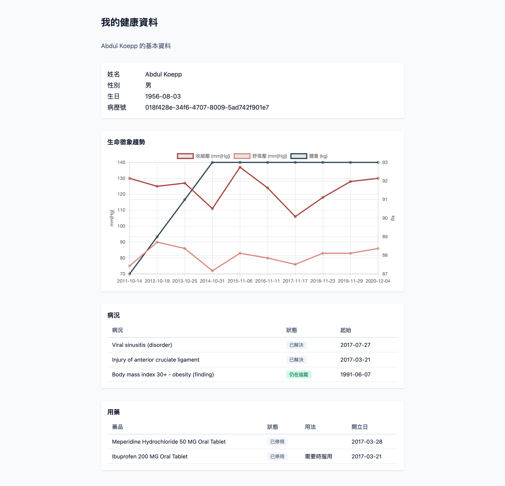

# SMART on FHIR 範例程式

用瀏覽器原生 JavaScript 寫的 SMART on FHIR app，沒有打包工具、沒有框架、不需要 Node.js。

**[打開線上版](https://losehrt.github.io/ithome-2026-smart-app/)**，每一天都可以直接點進去跑，不用 clone 也不用起伺服器。

[](https://losehrt.github.io/ithome-2026-smart-app/day17-clinical-data/)

上面是 day17 跑起來的樣子：走完 SMART 授權，讀出病人基本資料、生命徵象趨勢，以及病況與用藥兩張表。資料來自公開測試 sandbox 的合成病人。

## 這是什麼

這些程式碼重走了一次「火線超人」的路。火線超人是一套已經在跑的醫療資料應用，用 Rails 寫的，接真實的醫院 FHIR 伺服器。這裡把同一套協定用最多人會的技術再實作一次。

換語言不是因為 Rails 做不到，而是想證明一件事：**要參與醫療資料互通，不必先成為醫療資訊工程師。** 你會 Web、懂 HTTP、寫得動 JavaScript，就足以做出一個符合國際標準的 SMART on FHIR app。

SMART on FHIR 是國際通行的醫療資料交換標準，台灣也正在推。這個領域長期被當成醫院資訊室的專業，門檻其實沒有那麼高，缺的是有人把路走一遍給你看。

程式碼出自 2026 iThome 鐵人賽的[一個系列](https://ithelp.ithome.com.tw/users/20183398/ironman/9100)，隨文章進度更新。每個資料夾對應一篇文章，也各自有一個同名的 git tag。

## 怎麼跑

任選一個資料夾，起一個靜態伺服器就好：

```bash
cd day06-smart-discovery
python3 -m http.server 5173
```

瀏覽器開 <http://localhost:5173>，按 F12 看 console。

不能用 `file://` 直接開 `index.html`，`type="module"` 的檔案會被 CORS 擋掉。

## 目前有哪些

每一天一個資料夾，各自是一份完整可跑的專案，讀到哪一天就進那個資料夾，不用回頭拼湊前幾天的檔案。

第一欄的資料夾名稱點下去是那一天的線上版，直接在瀏覽器裡跑。

| 資料夾 | 對應文章 | 內容 |
|---|---|---|
| [`day04-sandbox-setup/`](https://losehrt.github.io/ithome-2026-smart-app/day04-sandbox-setup/) | day04 開發環境準備 | 連上公開 FHIR server，畫面顯示「連線成功：Patient/…」 |
| [`day06-smart-discovery/`](https://losehrt.github.io/ithome-2026-smart-app/day06-smart-discovery/) | day06 SMART Discovery 與能力探索 | 新增 `discovery.js`，問出授權端點與 token 端點 |
| [`day09-first-authorization/`](https://losehrt.github.io/ithome-2026-smart-app/day09-first-authorization/) | day09 從頭跑完一次授權 | 再加上 `pkce.js` 與 `auth.js`，走完一趟 standalone 授權，console 印出 access token 與 patient id |
| [`day12-launch-context/`](https://losehrt.github.io/ithome-2026-smart-app/day12-launch-context/) | day12 解析 Launch Context | 換用 `fhirclient`，`app.js` 整份替換成三十行不到的版本，畫面從 patient id 變成病人姓名與生日。其餘五個檔案與 day09 一字不差，`discovery.js`、`pkce.js`、`auth.js` 不再被引用但留著 |
| [`day14-token-lifecycle/`](https://losehrt.github.io/ithome-2026-smart-app/day14-token-lifecycle/) | day14 Token 的生命週期 | 第二幕終態，只剩 `index.html`、`app.js`、`vendor/` 三樣。`SCOPE` 加上 `offline_access`，多一顆按鈕手動換 token，並把用過的那張 refresh token 再送一次看伺服器收不收 |
| [`day15-first-smart-app/`](https://losehrt.github.io/ithome-2026-smart-app/day15-first-smart-app/) | day15 第一個 SMART app | 第三幕起點。新增 `patient.js` 把 Patient 資源整理成姓名、性別、生日、病歷號四個欄位，畫面第一次有東西可以給人看。取姓名走四層 fallback，因為 Patient 上幾乎所有欄位都是選填的 |
| [`day16-clinical-data/`](https://losehrt.github.io/ithome-2026-smart-app/day16-clinical-data/) | day16 呈現臨床資料（一） | 新增 `vitals.js`，把血壓與體重從 Observation 挖出來畫成雙 y 軸趨勢圖。血壓的值裝在 `component` 裡，體重直接掛在資源上，同一種資源兩種結構，取值要分開寫。畫圖用 Chart.js |
| [`day17-clinical-data/`](https://losehrt.github.io/ithome-2026-smart-app/day17-clinical-data/) | day17 呈現臨床資料（二） | 新增 `clinical.js`，把病況與用藥列成兩張表。CodeableConcept 取顯示文字寫成 `text` 到 `display` 到 `code` 的三層優先序，狀態欄位另走一個只取 `code` 的函式，再自己對照成中文。版面用免建置的 `@tailwindcss/browser`，一個 script 標籤沒有設定檔 |
| [`day18-write-back/`](https://losehrt.github.io/ithome-2026-smart-app/day18-write-back/) | day18 寫回 FHIR | 新增 `write.js`，把自己量的血壓存回伺服器。`SCOPE` 加一個 `c` 同意畫面就多一行，POST 回 201，但 `Location` 與 `ETag` 在瀏覽器裡因為 CORS 讀不到，新資源的 id 只能從回應 body 取 |
| [`day19-error-handling/`](https://losehrt.github.io/ithome-2026-smart-app/day19-error-handling/) | day19 FHIR 伺服器的處理錯誤 | 新增 `errors.js`，六顆按鈕各觸發一種失敗。先看 `Content-Type` 再決定怎麼解析，因為 401 回的是純文字而不是 `OperationOutcome`，無條件呼叫 `response.json()` 會在那裡丟例外。走 `client.request()` 的那一顆只能讀 `status` 與 `message`，body 在 throw 之前就被 `parse()` 讀掉了 |
| [`day20-search-and-write/`](https://losehrt.github.io/ithome-2026-smart-app/day20-search-and-write/) | day20 FHIR 搜尋，分頁不要自己算 | 新增 `search.js`，跟完 10 頁 94 筆。分頁只能照抄 `next`，自己算 offset 在這台行不通，因為它的 `next` 換成了一串 `_getpages` 的暫存 id。`_include` 帶回來的資源要看 `entry.search.mode` 才分得出哪幾筆是你查的 |
| [`day22-multi-server/`](https://losehrt.github.io/ithome-2026-smart-app/day22-multi-server/) | day21 與 day22 兩家醫院 | 第三幕終態。新增 `servers.js`，兩家醫院各自一組 `clientId` 與 `scope`，端點靠 discovery 問出來並快取一天。拿 B 醫院的 token 去打 A 醫院不會回 403，它回 200 加一份標著 `SUBSETTED` 的殘缺資料 |

連著跑好幾天的話，換一天之前先重新整理並清掉分頁的 session。授權結果存在 `sessionStorage`，同一個網域底下共用，後面那天會沿用前一天那張 token，而每一天要的 scope 並不相同。最容易看出來的是 day14：沿用 day12 的 token 就沒有 refresh token，那一天的手動換 token 會換不成。本機把每個資料夾都跑在同一個 port 也是一樣的情形。

系列還在進行中，後面的資料夾會隨文章發布陸續加進來。

day01 到 day03 與 day05 沒有可跑的專案，那幾篇是 FHIR 資源與 HTTP 請求的範例片段，直接讀文章即可。day07 全程在瀏覽器網址列上操作，一個檔案都不用動。day08 新增的 `pkce.js` 跑起來畫面與 day06 一樣，那一篇的驗證是在 console 裡做的，要對照參考寫法就看 `day09-first-authorization/pkce.js`，內容完全相同。

day10 與 day11 也沒有各自的資料夾。兩篇的跟著做都是改 `auth.js` 裡 `SCOPE` 那個常數的值再重跑，day10 看同意畫面多幾行、day11 看 token response 少哪些欄位。檔案組成與 `day09-first-authorization/` 相同，開那一份改 `SCOPE` 就能重現兩篇的每一次實驗。

day13 也沒有。那一篇在 `app.js` 裡加幾行讀 `id_token`，但跟著做的第四步是換成醫護身分再跑一次，收穫是兩種身分之下 `fhirUser` 指向的資源型別不同。任何一份靜態資料夾都只能凍結其中一次。開 `day14-token-lifecycle/` 就有那幾行讀 `id_token` 的寫法。

## sandbox 設定可以換成自己的

**每一份都可以直接跑，不必先改任何一行。** 下面這些檔案裡的 FHIR base URL 帶著一串 `/sim/` 編碼，那是 Launcher 的模擬設定，但它是無狀態的：整組設定就編在那串字裡，不綁任何人的 session，所以檔案裡已經填好的那串誰拿去用都成立。

| 檔案 | 常數 |
|---|---|
| `day06-smart-discovery/app.js` | `FHIR_BASE_URL` |
| `day09-first-authorization/app.js` | `FHIR_BASE_URL` |
| `day12-launch-context/app.js` | `FHIR_BASE_URL` |
| `day14-token-lifecycle/app.js` | `FHIR_BASE_URL` |
| `day15-first-smart-app/app.js` | `FHIR_BASE_URL` |
| `day16-clinical-data/app.js` | `FHIR_BASE_URL` |
| `day17-clinical-data/app.js` | `FHIR_BASE_URL` |
| `day18-write-back/app.js` | `FHIR_BASE_URL` |
| `day19-error-handling/app.js` | `FHIR_BASE_URL` |
| `day20-search-and-write/app.js` | `FHIR_BASE_URL` |

這十份填的是同一串，解碼後是 `[3,"","","AUTO",…]`，也就是 Patient Standalone Launch 加自動選病人，沒有指定客戶端也沒有限制 scope。

要換成自己的就到 [SMART Health IT Launcher](https://launch.smarthealthit.org/)，Launch Type 選 **Patient Standalone Launch**，複製 **Server's FHIR Base URL** 欄位那一整串貼上去。

`day22-multi-server/` 不在上面那張表裡。它的兩家醫院各有一組設定，寫在 `servers.js` 的 `SERVERS.a` 與 `SERVERS.b`，每一組除了 `fhirBaseUrl` 還有自己的 `clientId` 與 `scope`。要換成自己的，就在 Launcher 開兩份設定，填不同的 Client ID、Scopes 與病人，再把兩串 base URL 各自貼進去。

**day13 的跟著做一定要換。** 那一篇的第四步是把 `FHIR_BASE_URL` 與 `SCOPE` 換成醫護身分再跑一次，比較兩種身分之下 `fhirUser` 指向的資源型別，不換就只看得到病人那一邊。day10 與 day11 也要改設定，但改的是 `SCOPE` 那個常數，base URL 不動。

`day04-sandbox-setup/` 不在這張表裡，它連的是 `https://r4.smarthealthit.org`，不需要授權也沒有模擬設定。

## 資料都是假的

範例連的是 SMART Health IT 的公開 sandbox，裡面的病人由 [Synthea](https://synthetichealth.github.io/synthea/) 合成，不是去識別化的真人資料。

那是公開的測試環境，**資料是共用的**，任何人寫進去的東西大家都看得到。

**絕對不要放入真實病人資料，一筆都不要**，包括拿真人的姓名或生日去測試。

從 `day18-write-back/` 開始，範例會**寫資料進去**。你寫進去的東西會留在上面，不會自動清掉，測完想清就自己送一個 `DELETE /Observation/{id}`，回 200 就是刪掉了。

那個資料夾的 `SCOPE` 含 `c`（寫成 `patient/*.crs`），跑起來就有寫入權限。這台 sandbox 在資源端不檢查 scope，所以權限設錯在這裡不一定看得出來，換到真實 EHR 才會變成 403。

## 授權

這個 repo 的程式碼採 [MIT 授權](LICENSE)，可以自由取用、修改、放進你自己的專案。

**`vendor/` 底下的檔案不在這個 MIT 授權的涵蓋範圍**，它們是第三方的作品，各自帶著自己的授權條款：

| 檔案 | 版本 | 授權 | 來源 |
|---|---|---|---|
| `vendor/fhir-client.pure.min.js` | 2.6.3 | Apache-2.0 | [smart-on-fhir/client-js](https://github.com/smart-on-fhir/client-js) |
| `vendor/fhir-client.pure.min.js.LICENSE.txt` | — | MIT | 上面那支檔案打包進去的第三方程式碼授權聲明，由它開頭的 banner 指名 |
| `vendor/chart.umd.js` | 4.5.1 | MIT | [chartjs/Chart.js](https://github.com/chartjs/Chart.js) |
| `vendor/tailwind-browser.js` | 4.3.3 | MIT | [tailwindlabs/tailwindcss](https://github.com/tailwindlabs/tailwindcss) 的 `@tailwindcss/browser` |
| `vendor/tailwind-browser.js.LICENSE.txt` | — | MIT | 上面那支檔案的授權全文。它本身沒有 banner，所以另存一份，逐字取自該版本 tag 的 `LICENSE` |

這些檔案都已經下載進版控，clone 下來不需要網路就能跑，執行期也不連 CDN。要自己重抓的話：

```bash
curl -o vendor/fhir-client.pure.min.js \
  https://cdn.jsdelivr.net/npm/fhirclient@2.6.3/build/fhir-client.pure.min.js

curl -o vendor/fhir-client.pure.min.js.LICENSE.txt \
  https://cdn.jsdelivr.net/npm/fhirclient@2.6.3/build/fhir-client.pure.min.js.LICENSE.txt

curl -o vendor/chart.umd.js \
  https://cdn.jsdelivr.net/npm/chart.js@4.5.1/dist/chart.umd.js

curl -o vendor/tailwind-browser.js \
  https://cdn.jsdelivr.net/npm/@tailwindcss/browser@4.3.3/dist/index.global.js

curl -o vendor/tailwind-browser.js.LICENSE.txt \
  https://raw.githubusercontent.com/tailwindlabs/tailwindcss/v4.3.3/LICENSE
```

`day04` 到 `day09` 這三個資料夾都還沒用到這支 client，`day12-launch-context/` 才正式換過去，整份 `app.js` 靠它重寫。

`chart.umd.js` 從 `day16-clinical-data/` 開始用得到，208518 bytes，那是免建置畫圖換來的代價。

`tailwind-browser.js` 從 `day17-clinical-data/` 開始用得到，282289 bytes。它是跑在瀏覽器裡的 JIT 編譯器，掃 DOM 上的 class 即時產生 CSS，所以不需要 npm 也不需要建置步驟。**官方說這個版本只適合開發，不要用在正式環境**，因為每個使用者的瀏覽器都要跑一次編譯。正式做法是裝 npm 加一個建置步驟，讓它事先產出一份只含用到的 class 的靜態 CSS。
